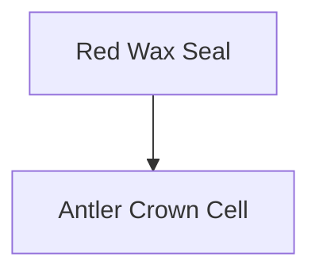

# ttrpg-vault-rich-notes

Use this skill when composing or improving durable Markdown notes in
`vault/notes/`. It is intentionally separate from `ttrpg-vault-authoring` so the
agent can load rich-writing details only when needed. First decide **where** the
note lives with `ttrpg-vault-authoring`; then use this skill for **how** the note
should read and render in Obsidian.

This skill adapts Obsidian-flavored Markdown practices for this D&D prep vault.

## Core goals

A rich note should be:

1. **Usable at the table** — the first screen contains the summary, stakes, and
   next actionable details.
2. **Graph-connected** — important people, places, factions, items, sessions,
   books, canvases, and clues are linked in the body.
3. **Searchable** — frontmatter and headings use stable, obvious names.
4. **Source-backed** — local books, 5etools records, archive notes, or user text
   are cited without dumping long copyrighted passages.
5. **Progressively structured** — stubs stay short; important notes get richer
   sections, callouts, embeds, and block IDs.

## Default note skeleton

Preserve the frontmatter policy from `ttrpg-vault-authoring`. Then tune the body
for the note type.

```markdown
---
type: npc | location | faction | session | monster | item | spell | rules | readaloud | handout | canvas | meta | draft
source: agent | user | imports/source-vault/<path> | imports/books/<file>.pdf | vault/library/books/<book>/<chapter>.md
created: YYYY-MM-DD
tags: [campaign]
status: draft | reviewed | canon
aliases: []
---

# Title

## At a Glance
One to three bullets that make the note usable immediately.

## Details
Table-facing material, organized by what the DM needs to run.

## Connections
- [[related-note]] — why it matters.

## Sources
- agent
```

`aliases` is optional but useful for NPC titles, alternate spellings, translated
names, old archive names, and player-facing names.

## Obsidian syntax to use well

### Wikilinks

Use wikilinks for vault-internal notes and Markdown links only for external URLs.

```markdown
[[note-name]]
[[note-name|Display Text]]
[[note-name#Heading]]
[[note-name#^block-id]]
[[#Same-note heading]]
```

Guidelines:

- Prefer stable slug links for authored active notes: `[[mara-vale]]`.
- Use aliases for display text: `[[mara-vale|Captain Mara Vale]]`.
- Path-qualify links to generated book overviews when needed, e.g.
  `[[library/books/the-pit-in-the-forest-v1-2-basic-bx|The Pit in the Forest]]`.
- Path-qualify generated book chapter links when ambiguity is possible, and only
  after checking the file exists.

### Embeds

Embed only when inline context is worth the visual weight.

```markdown
![[note-name#Heading]]
![[image.png|500]]
![[document.pdf#page=3]]
```

Good TTRPG uses:

- image or handout preview in a session note
- a specific read-aloud section embedded in session prep
- a monster or encounter checklist embedded in a location note

Avoid embedding whole long notes by default; it makes notes hard to scan.

### Callouts

Callouts are excellent for table-facing emphasis and hidden DM organization.

```markdown
> [!tip] Running Cue
> Lead with smell and sound before visual detail.

> [!warning] If the players delay
> Advance the clock by one segment.

> [!question]- Unresolved
> Who paid the ferryman to lie?
```

Recommended callout meanings:

| Type | Use |
|---|---|
| `info` / `note` | neutral context or reminders |
| `tip` | running advice, improv hooks, roleplay cues |
| `warning` | danger, timer, failure consequence |
| `question` | unresolved mystery, open prep question |
| `success` | reward, leverage, ally response |
| `danger` | lethal threat, betrayal, hard move |
| `quote` | short read-aloud or player-facing text |
| `example` | sample DC/result, sample dialogue |

### Tags

Use frontmatter `tags` for durable categories. Inline tags are fine for transient
or local emphasis, but do not replace links.

```yaml
tags: [campaign, session-prep, faction]
```

Tag syntax supports nested tags like `campaign/arc-one`; avoid spaces.

### Block IDs

Use block IDs for precise links to clues, secrets, or boxed text that another
note/canvas may reference.

```markdown
The red wax seal bears a broken antler above a black wave. ^red-wax-seal-clue
```

For lists or quotes, put the ID after the block:

```markdown
> The bells stop all at once.

^bells-stop-readaloud
```

Choose human-readable kebab-case block IDs.

### Comments

Use Obsidian comments sparingly for temporary drafting notes that should not
render in reading view.

```markdown
%% reconcile this with Blackthorne timeline before canonizing %%
```

Do not hide important canon only in comments.

### Highlights, math, Mermaid

````markdown
==Important reveal==


````

Use Mermaid when a lightweight diagram inside a note is enough. Use
`ttrpg-vault-canvas` when the visual map should be a durable, editable Obsidian
Canvas with file nodes and spatial layout.

## TTRPG-rich note patterns

### NPC note

```markdown
## At a Glance
- **Role:** smuggler captain who can move the party unseen.
- **Wants:** protection for her crew from [[blackthorne-levies]].
- **At the table:** clipped speech, never sits with her back to a door.

> [!tip] Voice
> Low, amused, speaks in weather metaphors.

## Secrets
- Knows the route under [[saltmarsh-gate]]. ^knows-saltmarsh-route

## Leverage
- Help her crew and she offers one quiet crossing.

## Connections
- [[dunemark]] — base of operations.
- [[lord-blackthorne|Lord Blackthorne]] — squeezes her docks for taxes.
```

### Location note

```markdown
## At a Glance
- **Mood:** drowned bells, salt rot, shuttered windows.
- **Function:** clue hub and social pressure cooker.
- **Immediate hook:** a child has found a saint's fingerbone in the tidepool.

## Areas
### Bell Steps
- Slippery stone; DC 12 Dexterity save/check if sprinting in rain.
- Clue: black candle wax in the cracks. ^black-candle-wax

> [!warning] Pressure
> Each public disturbance adds 1 Heat with [[harbor-watch]].

## Connections
- [[harbor-watch]] — patrols at dusk.
```

### Session note

```markdown
## Goals for Tonight
- Bring the party to a clear choice about [[red-chapel]].
- Reveal at least two clues pointing at [[antler-crown-cell]].

## Recap
Short player-facing recap.

## Scene List
1. **Cold open:** short read-aloud or embedded read-aloud note.
2. **Investigation:** clues, DCs, fail-forward outcomes.
3. **Complication:** faction move or wandering threat.

## Clues to Seed
- [[#^red-wax-seal-clue]] — points at the noble patron.

## If Time Runs Short
Cut to the faction move and end on a strong decision.
```

### Rules/mechanics note

- Lead with the local ruling or conversion summary.
- Cite canonical source data when used.
- Separate table policy from raw rules text.
- Link monsters, spells, items, and Foundry notes when relevant.

### Read-aloud note

- Keep player-facing text short enough to read comfortably.
- Use `> [!quote]` for boxed text.
- Add DM notes below, not inside the quote.
- Link the scene/location/session that uses it.

## Source and citation practice

In `## Sources`, cite what you actually used:

```markdown
## Sources
- agent
- `imports/5etools/data/bestiary/...` for base monster mechanics
- `vault/library/books/<book>/<chapter>.md:<line>` for adventure/lore summary
- `imports/source-vault/<path>` for promoted archive inspiration
```

Prefer paraphrase. Short quoted phrases are fine for personal prep; avoid long
verbatim book excerpts in chat or newly authored notes unless the user asks for a
private table handout.

## Richness ladder

Use only as much structure as the note deserves:

1. **Stub:** frontmatter, title, one summary, one connection.
2. **Usable note:** at-a-glance, details, connections, sources.
3. **Table-ready note:** callouts, cues, secrets, blocks/anchors, session links.
4. **Hub note:** embeds, canvases, child note links, index-like sections.
5. **Canon note:** reviewed status, citations, contradiction notes resolved.

Do not bloat every note. A good stub is better than a sprawling unlinked draft.

## Review checklist before writing/updating

- Frontmatter exists and uses the project fields.
- The first screen tells the DM what this is and why it matters.
- Important relationships are body wikilinks, not only YAML.
- `## Connections` explains the relationship, not just a link list.
- Source section distinguishes agent invention from local materials.
- Any unresolved canon issue is marked with `status: draft` or a visible callout.
- Filenames and new link targets are slugged.
- No active note was written outside `vault/notes/`.

## References and attribution

- Obsidian Help: https://help.obsidian.md/
- Obsidian Flavored Markdown: https://help.obsidian.md/obsidian-flavored-markdown
- Adapted in part from Steph Ango's MIT-licensed Obsidian skills:
  https://github.com/kepano/obsidian-skills/tree/main/skills/obsidian-markdown
